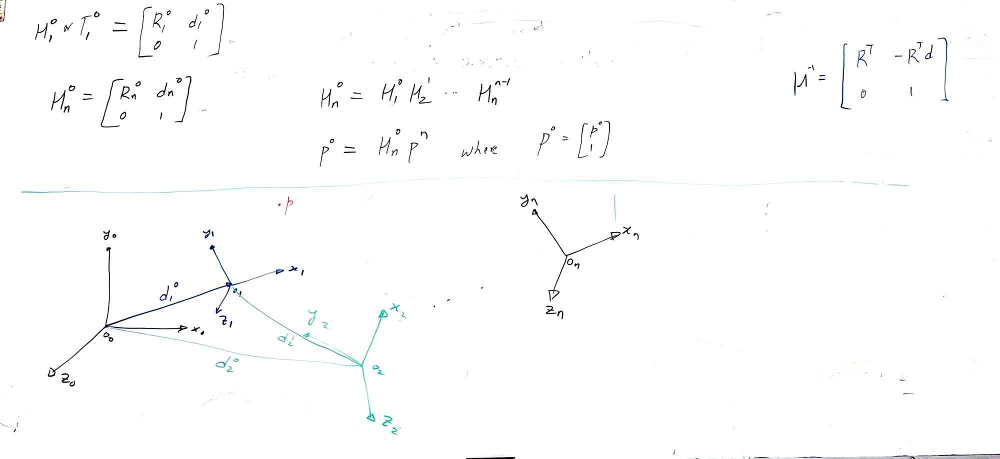
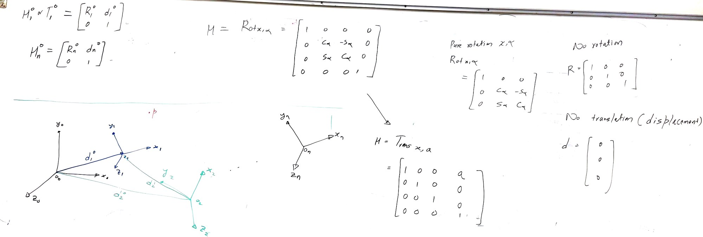
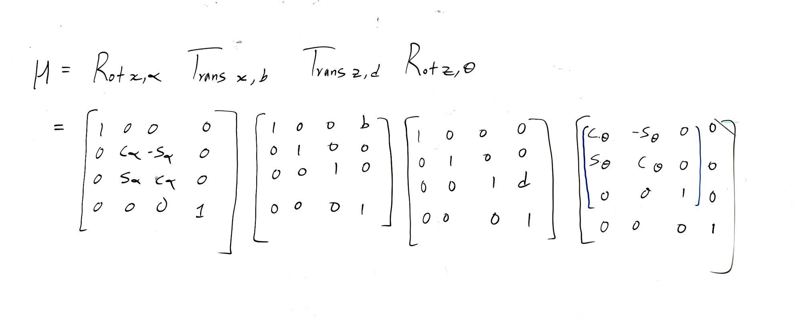
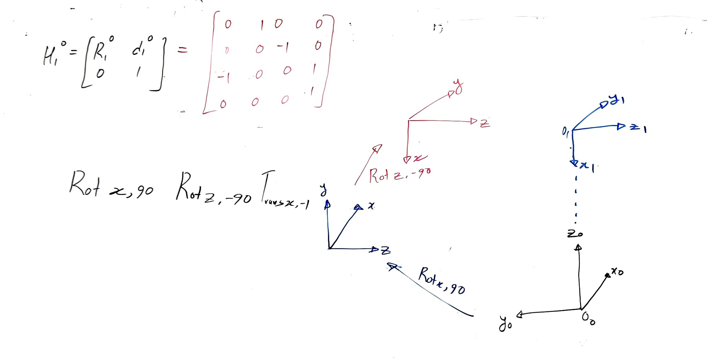

# Chapter 2: Rigid Motions and Homogeneous Transformations

Board captures from the Chapter 2 lectures, in the order they were developed: from rotation
between frames that share an origin, through rotation plus displacement, to the 4×4 homogeneous
transformation that carries both at once and composes by plain matrix multiplication.

Check Canvas for deliverables, deadlines, and grading rubric.

## Notation used on every board

| Symbol | Meaning |
|---|---|
| $p^1$ | Coordinates of the point $p$ expressed in frame 1 |
| $R^0_1$ | Orientation of frame 1 with respect to frame 0 |
| $d^0_1$ | Displacement from origin $o_0$ to origin $o_1$ |
| $H^0_1$ | Both at once, as a single 4×4 transformation |

---

## Board 1 — Rotation, then rotation with displacement

$$p^0 = R^0_1\,p^1 \qquad \longrightarrow \qquad p^0 = R^0_1\,p^1 + d^0_1$$

**Figure 1.** Above the line, frames 0 and 1 share an origin, so only orientation separates them
and a single rotation matrix converts between the two descriptions of $p$. The identities at the
right are the ones worth memorizing: a rotation matrix is orthogonal, so $R^{-1} = R^{T}$, and
successive rotations compose as $R^0_2 = R^0_1 R^1_2$. Below the line the origins separate, and
every conversion picks up the displacement term $d$. The three-frame sketch is the case to study:
the same point $p$ has a description in frames 0, 1, and 2, and the vectors $d^0_1$, $d^1_2$, and
$d^0_2$ are what tie them together.

Substituting the frame-1 description of $p$ into the frame-0 one carries that through:

$$\begin{aligned}
p^0 &= R^0_1\,p^1 + d^0_1 \\[2pt]
    &= R^0_1\left(R^1_2\,p^2 + d^1_2\right) + d^0_1 \\[2pt]
    &= R^0_1 R^1_2\,p^2 \;+\; R^0_1 d^1_2 + d^0_1
\end{aligned}$$

The last line splits cleanly into a rotation part and a displacement part, and that is where both
composition rules come from: $R^0_2 = R^0_1 R^1_2$ and $d^0_2 = R^0_1 d^1_2 + d^0_1$.

---

## Board 2 — Packing R and d into one 4×4

$$H^0_n = H^0_1 H^1_2 \cdots H^{n-1}_n$$

**Figure 2.** The rotation matrix and the displacement vector go into one 4×4 with a bottom row of
$[0\ 0\ 0\ 1]$. The payoff is at the centre of the board: chaining frames is now just multiplying
matrices in order, and the point itself is padded to four entries so a single multiplication does
the rotation and the translation together. The inverse in the top right is **not** found by
inverting the 4×4 numerically — the block structure gives it directly, as $R^{T}$ paired with
$-R^{T}d$.

---

## Board 3 — The elementary transformations

Rotation only $\Rightarrow d = 0$ &nbsp;&nbsp;·&nbsp;&nbsp; Translation only $\Rightarrow R = I$

**Figure 3.** Every transformation on the following boards is built from just these two pieces. A
pure rotation keeps the 3×3 block and zeroes the displacement column; a pure translation does the
opposite, carrying the identity in the rotation block and the distance in the last column. Reading
the 4×4 back the other way is the useful skill: the right-hand column tells you where the origin
moved, the upper-left block tells you how the axes turned.

---

## Board 4 — Four elementary transformations, multiplied out

$$M = \mathrm{Rot}_{x,\alpha}\; \mathrm{Trans}_{x,b}\; \mathrm{Trans}_{z,d}\; \mathrm{Rot}_{z,\theta}$$

**Figure 4.** The composition written out in full, one 4×4 per elementary motion, left to right: a
rotation of $\alpha$ about $x$, a translation of $b$ along $x$, a translation of $d$ along $z$, and
a rotation of $\theta$ about $z$. Check each factor against Board 3 — the first carries
$c\alpha / s\alpha$ in the lower-right block with an empty displacement column, the middle two
carry the identity with $b$ and $d$ in the last column. Order matters throughout, since these
matrices do not commute. Those four quantities — $\alpha, b, d, \theta$ — are the same four that
become the Denavit–Hartenberg parameters in the next chapter, so this product is worth being able
to expand from memory.

---

## Board 5 — Worked example: reading H off a frame sketch

Each entry of $R^0_1$ is the cosine of the angle between one axis of frame 1 and one axis of frame 0.

**Figure 5.** The whole method in one example. Each entry of $R^0_1$ is the dot product of one axis
of frame 1 with one axis of frame 0 — and because both are unit vectors, that dot product is just
the cosine of the angle between them. From the sketch, every angle is 0°, 90°, or 180°, so the
matrix fills with 1, 0, and −1 and no trigonometry is actually needed. Note the sign pattern: a −1
says two axes point in opposite directions. The displacement is read straight off the diagram as
one unit along $z_0$, and dropping $R$ and $d$ into the block form completes $H^0_1$.

---

## Board 6 — The same example, built from elementary motions

$$H^0_1 = \mathrm{Rot}_{x,90}\; \mathrm{Rot}_{z,-90}\; \mathrm{Trans}_{x,-1}$$

**Figure 6.** Board 5 read a transformation *off* a picture; this one goes the other way and
*builds* the same $H^0_1$ out of elementary moves. Follow the sketches right to left as the frame
is carried into place: the black frame rotates 90° about $x$ to give the blue one, that rotates
−90° about $z$ to give the red one, and a translation finishes the job. Multiply the three
matrices from Board 3 in this order and you get back the numeric matrix at the top of the board —
which is the check worth doing by hand, since it confirms the sketch and the algebra agree.
