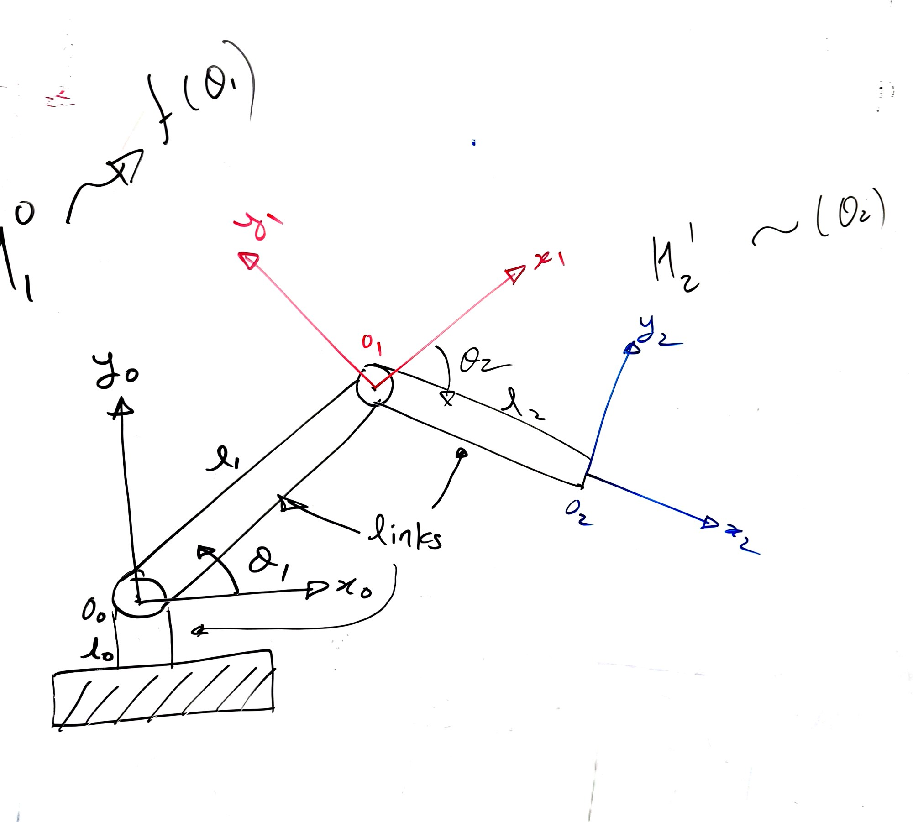
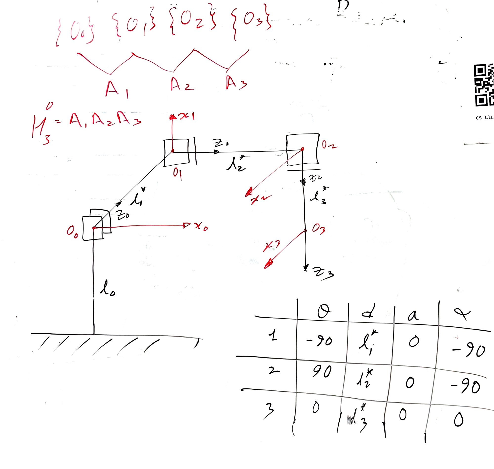

# Chapter 3: Forward Kinematics and the Denavit-Hartenberg Convention

Board captures from the Chapter 3 lectures. Chapter 2 built a transformation as a product of
elementary rotations and translations. Chapter 3 adds a rule: assign the frames a particular way,
and every joint's transformation collapses to the same four-factor product with four parameters.
The whole arm is then the product of those, one per joint.

Check Canvas for deliverables, deadlines, and grading rubric.

## The four DH parameters

| Parameter | Name | What it measures |
|---|---|---|
| $\theta_i$ | joint angle | rotation about $z_{i-1}$ that carries $x_{i-1}$ onto $x_i$ |
| $d_i$ | link offset | distance along $z_{i-1}$ from $o_{i-1}$ to where $x_i$ crosses it |
| $a_i$ | link length | distance along $x_i$ between the two $z$ axes |
| $\alpha_i$ | link twist | rotation about $x_i$ that carries $z_{i-1}$ onto $z_i$ |

Three of the four are fixed by the mechanism. **Exactly one is the joint variable**: $\theta_i$
for a revolute joint, $d_i$ for a prismatic one. On the boards the joint variable is marked with
a star, which is the fastest way to read a DH table: find the starred entry in each row and you
know what kind of joint it is.

---

## Board 1: Each joint contributes one transformation

$$H^0_1 = f(\theta_1) \qquad H^1_2 = f(\theta_2)$$



**Figure 1.** A two-link arm with a frame attached to every link: $o_0$ at the base, $o_1$ at the
elbow, $o_2$ at the tip. The annotations at the top left and right are the whole idea in
miniature. $H^0_1$ depends on $\theta_1$ and nothing else; $H^1_2$ depends on $\theta_2$ and
nothing else. Each transformation is a function of its own joint variable alone, which is exactly
what makes the chain composable: change one joint and only one matrix in the product changes.
Note also that the links are rigid, so $l_1$ and $l_2$ are constants, while $\theta_1$ and
$\theta_2$ are what the motors control.

---

## Board 2: The DH convention

$$A_i = \mathrm{Rot}_{z,\theta}\; \mathrm{Trans}_{z,d}\; \mathrm{Trans}_{x,a}\; \mathrm{Rot}_{x,\alpha}$$


**Figure 2.** On the left, what forward kinematics is for: joint variables go in, the position and
orientation of the end-effector come out, packaged in the usual block form:

```math
M = \begin{bmatrix} R & d \\ 0 & 1 \end{bmatrix}
```

The DH claim is the line below it. A general rigid transformation needs six parameters, three for
rotation and three for translation. If you assign frames following a specific rule, four are
enough, and the transformation always factors the same way, in the numbered order shown.

The two constraints are what you pay for that reduction, and they are the part to memorize:

- $x_i$ is **perpendicular** to $z_{i-1}$
- $x_i$ **intersects** $z_{i-1}$

The sketches on the right walk the frame through the four motions in order, with the sample
values at the bottom right showing which parameter each step consumes. Work them in the written
order; the factors do not commute.

---

## Board 3: Worked example, one revolute and one prismatic joint

$$H^0_2 = A_1 A_2$$


**Figure 3.** The first full worked example. The mechanism is a revolute joint at the base
followed by a prismatic joint that extends along the link.

| Link | $\theta$ | $d$ | $a$ | $\alpha$ |
|---|---|---|---|---|
| 1 | $\theta_1^{*} + 90$ | 0 | $l_{12}$ | 90 |
| 2 | 0 | $l_2^{*} + l_{11}$ | 0 | 0 |

Read the starred entries first: $\theta_1$ in row 1 and $l_2$ in row 2. That tells you joint 1 is
revolute and joint 2 is prismatic before you look at the drawing at all.

Two things students trip on here. First, the **$+90$ in row 1** is a constant offset forced by the
frame assignment, not an error. The DH angle is measured between the assigned $x$ axes, which need
not line up with the link you see in the picture, so read $\theta$ off the frames rather than off
the mechanism. Second, row 2's offset is $l_2^{*} + l_{11}$, a variable plus a constant: the
prismatic joint extends from a starting position that is already some distance out.

The chain at the right is the payoff. Three frames, two transformations, and the pose of the tip
in base coordinates is just their product.

---

## Board 4: Worked example, three prismatic joints

$$H^0_3 = A_1 A_2 A_3$$



**Figure 4.** Same procedure, a very different machine: all three joints are prismatic, giving a
Cartesian manipulator that translates along three mutually perpendicular axes.

| Link | $\theta$ | $d$ | $a$ | $\alpha$ |
|---|---|---|---|---|
| 1 | $-90$ | $l_1^{*}$ | 0 | $-90$ |
| 2 | $90$ | $l_2^{*}$ | 0 | $-90$ |
| 3 | 0 | $d_3^{*}$ | 0 | 0 |

Compare this table against Board 3's and the pattern falls out. Every starred entry is in the $d$
column, so every joint is prismatic. Every $a$ is zero, because consecutive axes intersect and
there is no offset along $x$. The $\theta$ and $\alpha$ entries are all fixed at $0$ or $\pm 90$:
they are not doing any moving, they are just the constant twists that set each axis perpendicular
to the last.

The procedure never changed. Only the table did, and that is the point of the convention: once the
frames are assigned, describing a manipulator is filling in four columns per joint, and the
forward kinematics is the product of the matrices those rows generate.
