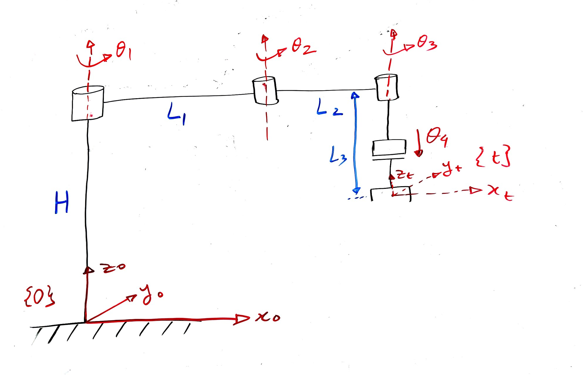

# Homework: Product of Exponentials

**[Download this problem set (PDF)](homework.pdf)** &nbsp;&middot;&nbsp;
**[Worked solutions](homework-solution.md)**

Back to the lecture page: [Forward Kinematics: Product of Exponentials](README.md).

Check Canvas for deliverables, deadlines, and grading rubric.

Two problems. Notation follows the lecture page *Forward Kinematics: Product of Exponentials*:
$S = (\omega, v)$ is a screw axis with $v = -\omega \times q$, $M$ is the home configuration, and
every quantity is expressed in the fixed base frame.

Show the work. An answer with no derivation earns no credit, and an answer you cannot check is
worth less to you than one you can.

---

## Problem 1. A SCARA arm, three revolute joints and one prismatic



The arm has four joints. Joints 1, 2 and 3 are revolute with axes parallel to the base $z$ axis
and pointing up. Joint 4 is prismatic and slides the tool **downward**, so that a positive $\theta_4$
lowers it.

The base frame $\{0\}$ sits on the ground with $z_0$ up. A column of height $H$ carries the joint
1 axis. The links have lengths $L_1$ and $L_2$, and $L_3$ is the fixed vertical drop from the
joint 3 axis down to the tool frame $\{t\}$ when $\theta_4 = 0$.

At the home configuration all four joint variables are zero, the arm lies straight along the base
$x$ axis, and $\{t\}$ is aligned with $\{0\}$.

Following §2 of the lecture page, every joint variable is written $\theta_i$ whatever the joint
type. So $\theta_4$ is a **displacement in metres**, not an angle.

**(a)** Write $\omega_i$ and, for the revolute joints, a point $q_i$ on each axis, then compute the
four screw axes $S_1$ through $S_4$. State clearly which rule you used for the prismatic joint and
why it differs from the revolute rule.

**(b)** Write the home configuration $M$.

**(c)** Write the product of exponentials for $H^0_t(\theta)$. Do not multiply it out.

**(d)** Take

```
H = 0.40 m,   L₁ = 0.35 m,   L₂ = 0.25 m,   L₃ = 0.15 m
```

and evaluate the model in Python using the `modern_robotics` library, at

```
θ₁ = 30°,   θ₂ = −60°,   θ₃ = 45°,   θ₄ = 0.10 m
```

Build `Slist` as a $6 \times 4$ array whose **columns** are your screw axes, angular part on top
and linear part beneath, build `M`, and call `FKinSpace(M, Slist, thetalist)`. Report the full
$4 \times 4$ pose. Submit the code with your answer.

Run one check before you trust it: `FKinSpace` with every joint variable set to zero must return
`M` exactly. If it does not, the error is in `Slist`, not in the library.

**(e)** One of the four screw axes has a zero linear part and one has a zero angular part.
Identify each and explain geometrically why.

---

## Problem 2. One rotation, three representations

A rotation is specified by the axis and angle

```math
\omega = \left(\tfrac{2}{3},\; -\tfrac{1}{3},\; \tfrac{2}{3}\right), \qquad \theta = \tfrac{2\pi}{3}
```

**(a)** Confirm that $\omega$ is a unit vector, then write $[\omega]$ and $[\omega]^2$.

**(b)** Apply Rodrigues' formula and write $R$. Keep $\sqrt{3}$ exact rather than decimalizing.

**(c)** Now work backwards, as in §3.5. Compute $\mathrm{tr} R$ and recover $\theta$ from it.
Then form $R - R^{T}$ and recover $\omega$. Confirm you get back what you started with.

**(d)** Write the unit quaternion $Q$ for this rotation, scalar part first, and confirm
$\|Q\| = 1$.

---

Solutions to all parts are in **[Worked solutions](homework-solution.md)**. Work the problems
first. Reading a solution you have not attempted teaches almost nothing, and the check in
Problem 1(d) exists so that you can confirm your own answer without needing the key at all.
