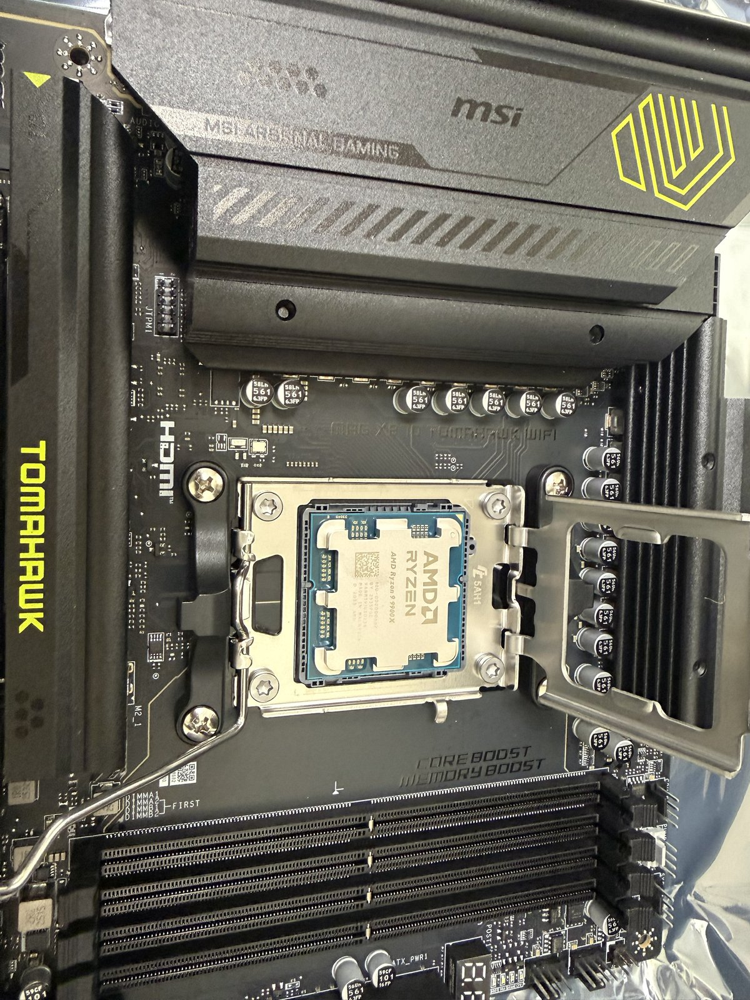
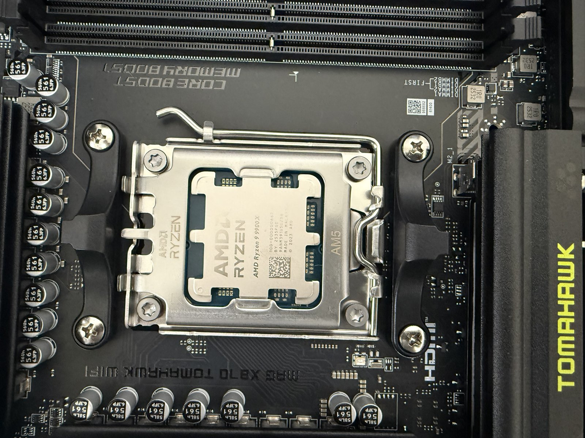

# Project 1: Computer Assembly

- CPU: AMD Ryzen 9 9900X
- Motherboard: MSI MAG X870
- RAM: G.SKILL Trident Z5 Neo (DDR5)
- GPU: NVIDIA RTX 5080 (MSI SHADOW 3X OC)
- SSD: Crucial T705 PCIe Gen5 NVMe
- CPU Cooler: Thermalright Peerless Assassin 120 SE
- PSU: MSI MAG A1000GL PCIE5 (1000W)
- Case: LIAN LI LANCOOL 216 E-ATX

## Instructions

1. **Prepare your workspace.** Work on a hard, non-carpeted surface. Wear an anti-static wrist strap, or regularly touch an unpainted metal surface to discharge static before handling components. Keep all component boxes and manuals nearby.

2. **Install the CPU.**
   - Unlock the motherboard's CPU socket lever and lift the retention arm.
   - Align the gold triangle/notch on the AMD Ryzen 9 9900X with the triangle on the socket.
   - Lower the CPU straight down with no force. It should drop in flush.
   - Close the retention arm and lever to lock the CPU in place.

    

   The CPU sits flat in the open socket on the left, and the load plate is closed over it on the right. Do not press down on the CPU itself at any point.

3. **Install the CPU cooler.**
   - Apply a small pea-sized dot of thermal paste to the center of the CPU if it is not pre-applied on the cooler's base.
   - Mount the Thermalright Peerless Assassin 120 SE using the AM5 bracket and backplate included with the cooler, following the cooler's manual for standoff placement.
   - Tighten mounting screws in an alternating (star) pattern to seat the cooler evenly.
   - Connect the CPU fan header(s) to the `CPU_FAN` (and `CPU_FAN2`, if present) header on the motherboard.

4. **Install the RAM.**
   - Check the MSI MAG X870 manual for the recommended dual-channel slots (typically the 2nd and 4th slots from the CPU).
   - Open the slot latches, align the notch on the G.SKILL Trident Z5 Neo modules with the slot, and press straight down firmly until the latches click closed.

5. **Install the M.2 NVMe SSD.**
   - Locate the primary M.2 slot on the MSI MAG X870 (the Gen5 slot, usually closest to the CPU).
   - Remove the M.2 heatsink/shield, remove the backing film from any included thermal pad, install the Crucial T705 into the slot at an angle, press down, and secure with the mounting screw.
   - Reattach the M.2 heatsink/shield.

6. **Unbox the case and remove both side panels.** Set aside the screw packs and standoffs that came with it.

7. **Install the motherboard I/O shield and standoffs.**
   - Press the I/O shield that came with the MSI MAG X870 into the rear cutout of the LIAN LI LANCOOL 216 case from the inside.
   - Confirm standoffs in the case match the motherboard's screw holes (E-ATX layout).

8. **Mount the motherboard in the case.**
   - Lower the motherboard in at an angle to align the rear ports with the I/O shield, then lay it flat onto the standoffs.
   - Secure with screws in a crisscross pattern, snug but not overtightened.

9. **Install the power supply.**
   - Mount the MSI MAG A1000GL PCIE5 in the PSU bay (fan facing down toward a vent, or up if the case has no bottom vent) and secure with the four included screws.

10. **Connect motherboard power cables.**
    - Connect the 24-pin ATX cable from the PSU to the motherboard.
    - Connect the 8-pin (4+4) EPS CPU power cable from the PSU to the motherboard's CPU power connector near the top.

11. **Install the GPU.**
    - Remove the appropriate rear expansion slot covers on the case for a double/triple-slot card.
    - Open the primary PCIe x16 slot latch, align the RTX 5080's connector with the slot, and press down firmly until the latch clicks and the card is seated flush.
    - Screw the GPU bracket into the case.
    - Connect the required PCIe power cable(s) from the PSU to the GPU (check the card for the number of connectors required).
    - If the case includes a GPU support bracket, install it to prevent sag.

12. **Connect case fans and front-panel connectors.**
    - Connect any case fans (pre-installed in the LANCOOL 216) to available `SYS_FAN` headers on the motherboard, or to a fan hub if provided.
    - Connect the front-panel header cables (power switch, reset switch, power LED, HDD LED) to the motherboard's front-panel header, matching pin labels in the motherboard manual.
    - Connect front-panel USB and audio headers to their corresponding motherboard headers.

13. **Cable management.**
    - Route cables through the case's cable-routing channels and behind the motherboard tray where possible.
    - Use zip ties or the case's built-in cable straps to secure loose cables away from fans.

14. **Final check before power-on.**
    - Verify RAM, GPU, and CPU cooler are fully seated.
    - Verify 24-pin, EPS, and GPU power cables are all connected.
    - Verify no tools or loose screws are inside the case.

15. **First boot.**
    - Connect a monitor to the GPU's video output (not the motherboard's).
    - Connect keyboard, mouse, and power cable, then power on.
    - Confirm the system POSTs (displays the motherboard splash screen), then enter BIOS to confirm the CPU, RAM (correct speed/capacity), and storage are all detected.

16. **Close up the case.**
    - Once the system boots successfully, reattach both side panels.
