# Project 1: Computer Assembly

- CPU: AMD Ryzen 9 9900X (AM5)
- Motherboard: MSI MAG X870 TOMAHAWK WIFI
- RAM: G.SKILL Trident Z5 Neo RGB 32 GB (2 × 16 GB) DDR5-6000 CL30-38-38-96 1.35 V, EXPO
- GPU: NVIDIA RTX 5080 (MSI SHADOW 3X OC)
- SSD: Crucial T705 PCIe Gen 5 NVMe M.2
- CPU Cooler: Thermalright Peerless Assassin 120 SE
- PSU: MSI MAG A1000GL PCIE5 (1000W)
- Case: LIAN LI LANCOOL 216 E-ATX

Two things about the order below are deliberate.

Everything that mounts on the motherboard goes on while the board is still on the bench, in
steps 2 to 5, because the cooler overhangs both the memory slots and the M.2 socket once it
is fitted. The case does not come out of its box until step 6.

The first boot in step 14 runs on the CPU's integrated graphics through the motherboard's
HDMI port, with no graphics card fitted. The RTX 5080 goes in afterwards, in step 15. Getting
the base system to POST before adding a 360 W card means that if something does go wrong, you
have far fewer things to suspect.

## Instructions

1. **Prepare your workspace.** Work on a hard, non-carpeted surface. Wear an anti-static wrist strap, or regularly touch an unpainted metal surface to discharge static before handling components. Keep all component boxes and manuals nearby.

2. **Install the memory.**
   - The kit is two 16 GB DDR5-6000 modules rated CL30-38-38-96 at 1.35 V, with an EXPO profile. Check the label before you start.
   - Use **DIMMA2 and DIMMB2**, the 2nd and 4th slots counting from the CPU socket. The board silkscreens exactly these two as `FIRST` beside the slots.
   - One module per channel is what gives you dual-channel operation. Putting both in the same channel halves your memory bandwidth and nothing will warn you.
   - Using the far slot of each channel also matters electrically. The traces run from the CPU through the first slot to the second, so leaving the end slot empty creates an unterminated stub that reflects signal. That is often the difference between the EXPO profile training and failing.
   - Open the retaining clip on each slot, line up the off-centre notch in the module's contact edge, and press straight down on both ends until the clips snap shut. It takes more force than you expect.

   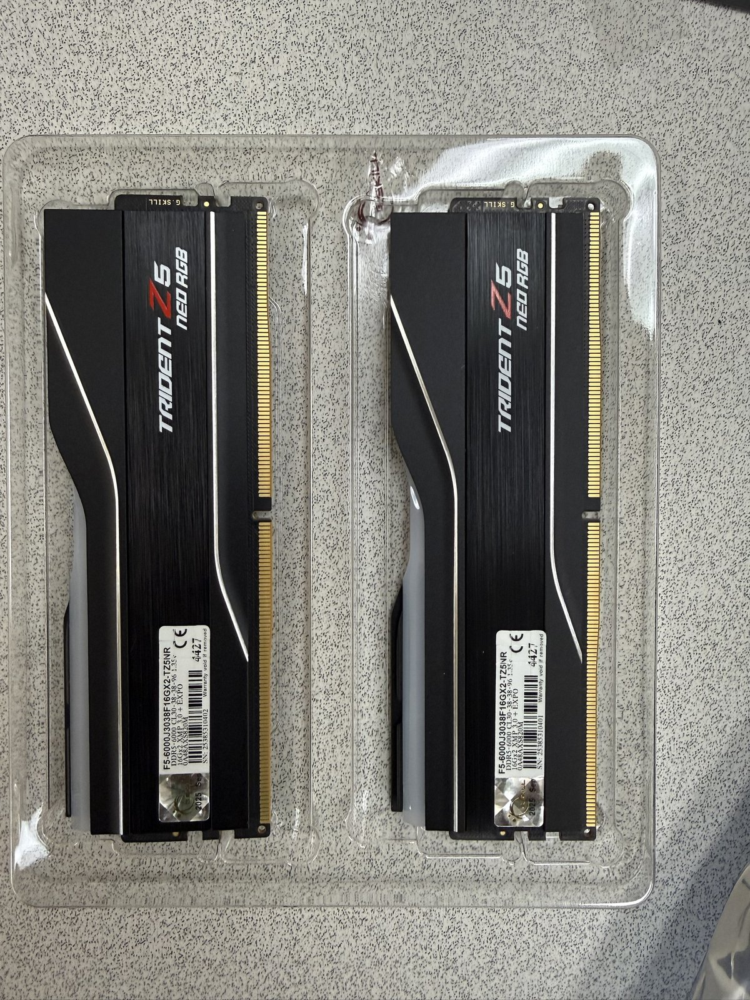

   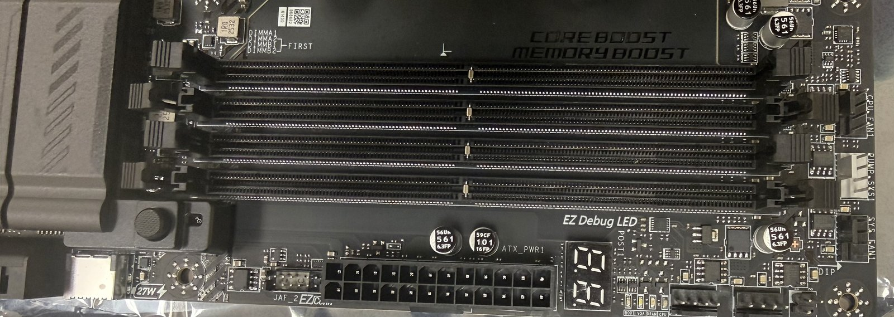

   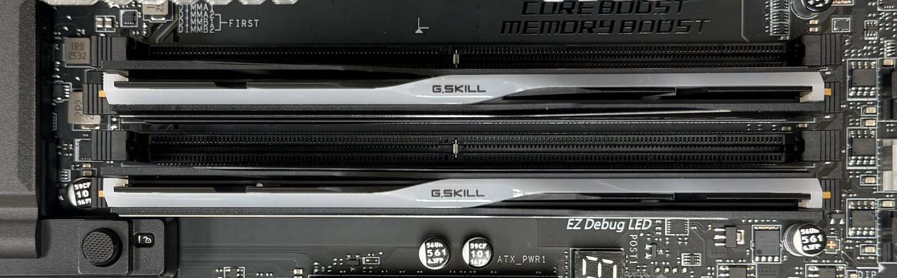

   Note in the last photo that the populated slots are the 2nd and 4th, with an empty slot between them and another at the end. That is correct.

3. **Install the M.2 NVMe SSD.**
   - The drive is a Crucial T705, a PCIe Gen 5 NVMe M.2 SSD.
   - Use `M2_1`, the CPU-connected Gen 5 slot beside the memory slots. It is the only slot that will run this drive at full Gen 5 speed. The board silkscreens each M.2 slot with its source (`CPU` or `CHIPSET`) and which interfaces it supports, so read the labels rather than guessing.
   - Remove the M.2 heatsink/shield covering that slot. It is the long shield with `TOMAHAWK` printed down it in yellow, running alongside the top PCIe slot. There is no screw holding it. Press the clip at its left end to release it, then lift the shield off.
   - Peel the protective film off the thermal pad underneath. It is printed with `REMOVE` across its whole face. Leaving it on insulates the drive from the very heatsink meant to cool it.
   - Slide the drive into the connector at roughly a 30° angle, then press the far end down flat.
   - This board uses a toolless retention clip rather than a screw. With the drive pressed flat, the clip latches over the end notch. No screwdriver needed. If the clip will not catch, the drive is not fully seated in the connector.
   - Reattach the heatsink/shield.

   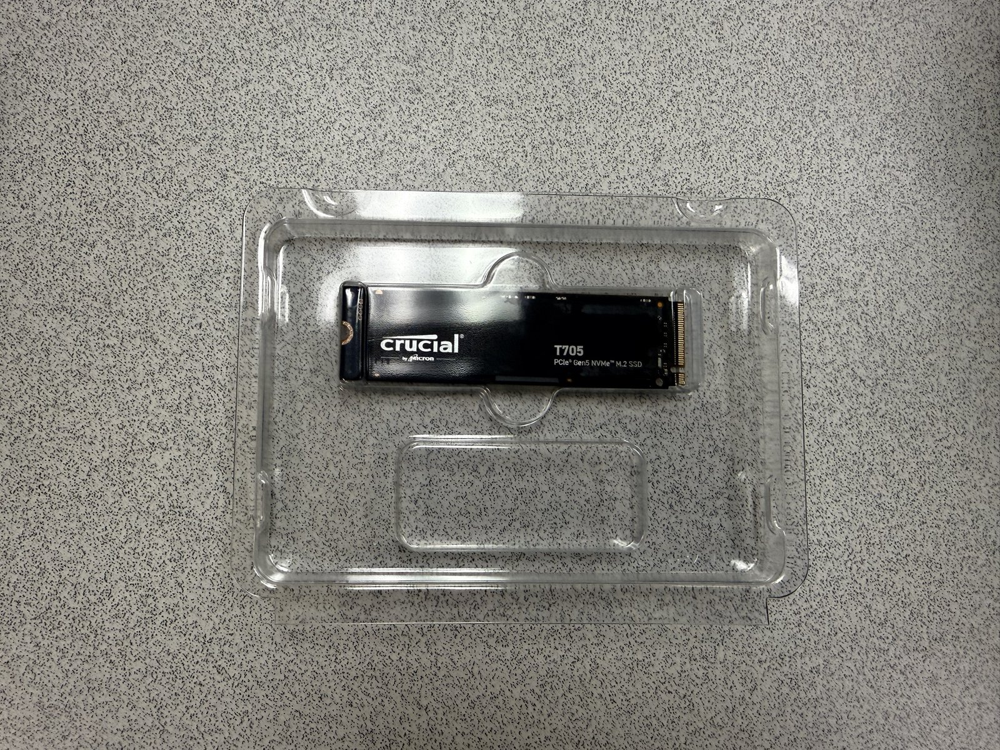

   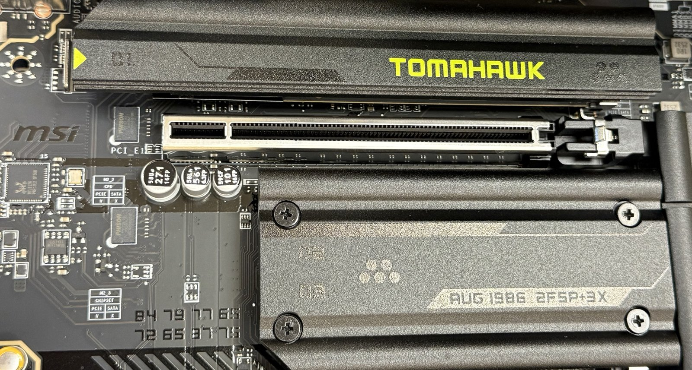

   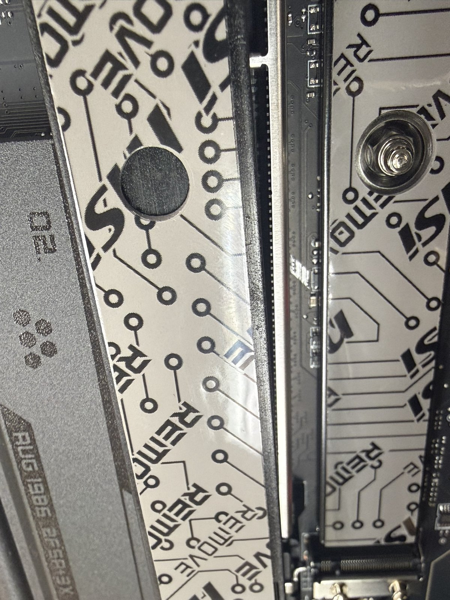 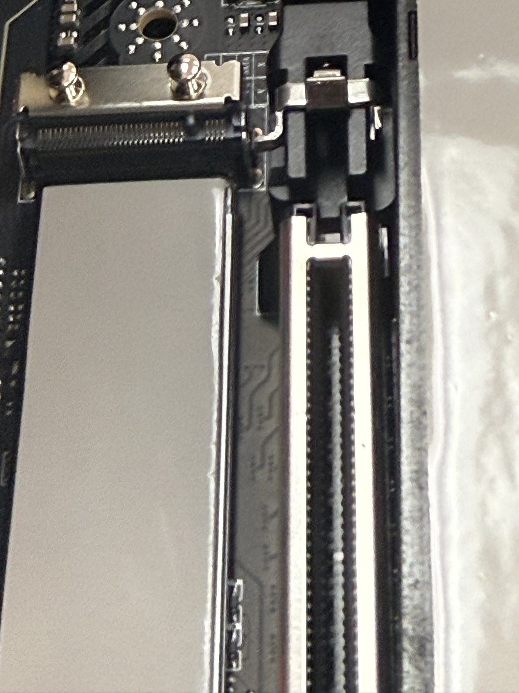

   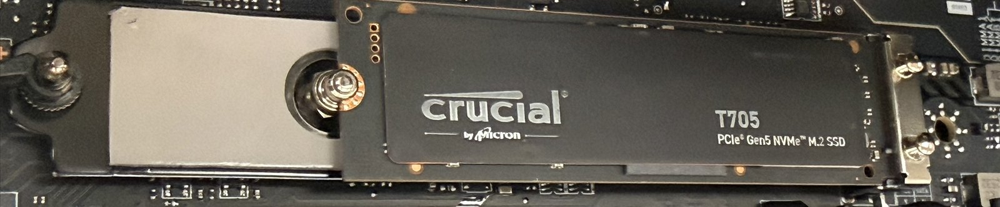

4. **Install the CPU.**
   - Unlock the motherboard's CPU socket lever and lift the retention arm.
   - Align the gold triangle/notch on the AMD Ryzen 9 9900X with the triangle on the socket.
   - Lower the CPU straight down with no force. It should drop in flush.
   - Close the retention arm and lever to lock the CPU in place.

   

   The 9900X sitting flat in the open socket, with the load plate swung clear and the memory from step 2 already in place above it. Note the small gold triangle at the corner of the CPU, which lines up with the matching mark on the socket frame. The chip drops in under its own weight once the triangles agree; if it sits proud, lift it straight out and check the alignment rather than pushing.

   

   Close the load plate over the CPU and lock the lever. The plate presses on the raised edge of the CPU, not on the die, so the closing force is normal and expected. Do not press down on the CPU itself at any point.

5. **Install the CPU cooler.**
   - Lay the kit out first so you can see what you have: the dual-tower heatsink, two 120 mm fans with their wire clips, the two mounting bars, a bag of screws and red standoffs, the thermal paste syringe, and the fan Y-splitter cable.
   - The mounting bars are stamped **AM4**. That is correct. AM4 and AM5 share the same cooler mounting pattern, so one bracket covers both sockets.
   - Screw the four red AM5 standoffs onto the board's mounting posts at the corners of the socket.
   - Lay the two mounting bars across the socket and tighten them down onto the standoffs.
   - Apply thermal paste: a pea-sized dot or a short line across the middle of the heat spreader. Do not spread it by hand. Clamping pressure spreads it far more evenly than you can.
   - Lower the heatsink squarely onto the CPU with its bracket over the two bars, then tighten the two captive spring screws **alternately**, a few turns on each side at a time, until they bottom out. Tightening one side fully first will cock the cooler and give you uneven contact.

   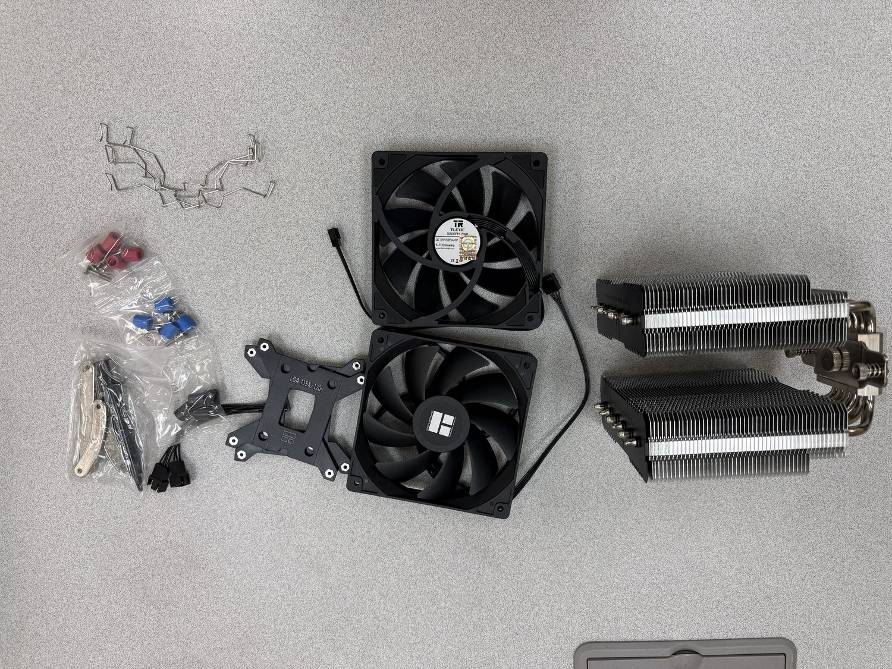

   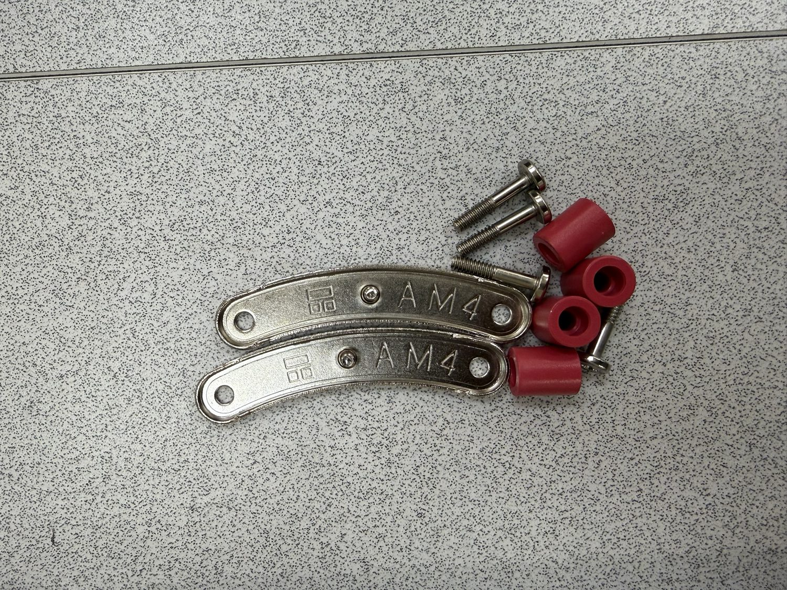 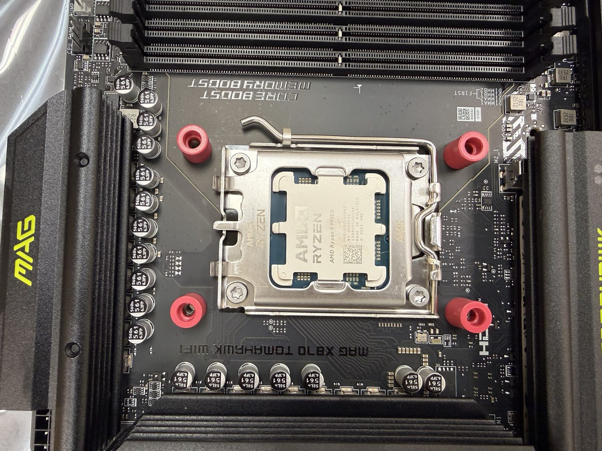

   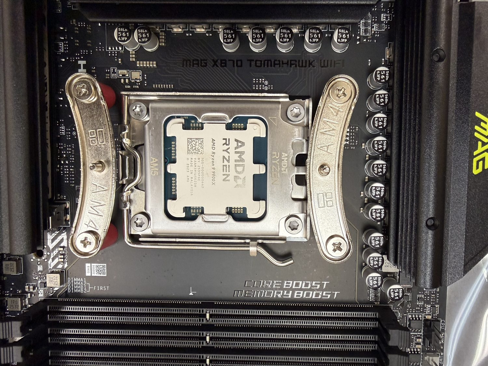 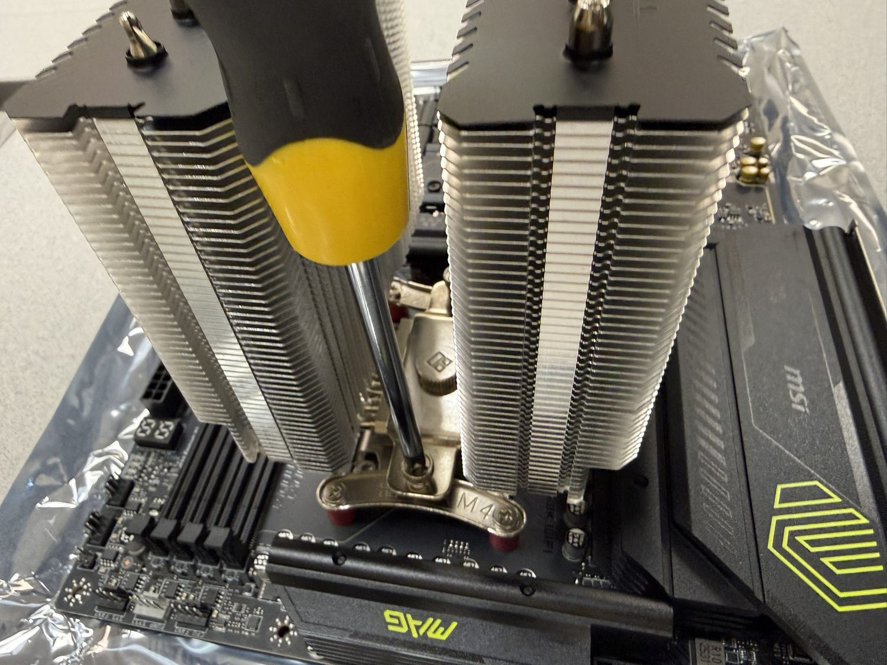

   - Clip the wire fan brackets into the mounting holes on each fan, then hook them over the fin stack.
   - **Fan orientation matters.** Air enters the open blade side and leaves the side carrying the motor label and support struts, so the **label side faces the fin stack**. Both fans face the same way, moving air front to back toward the rear of the case. Two small arrows moulded into the thin edge of the fan frame show airflow and rotation if you want to confirm it.
   - If the front fan fouls the memory heatspreaders, slide it upward on its clips.
   - Connect the fans to `CPU_FAN1`, using the supplied Y-splitter so both run from the one header.

   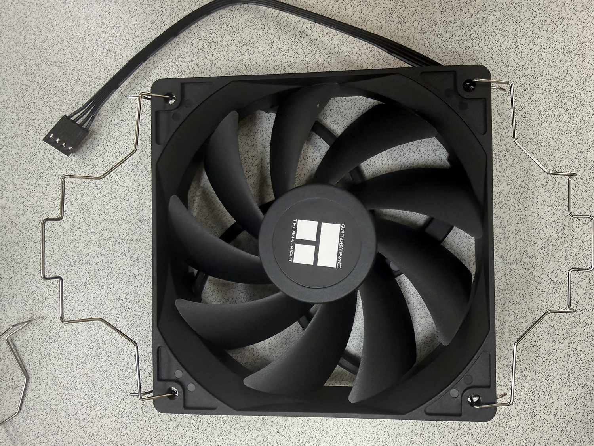 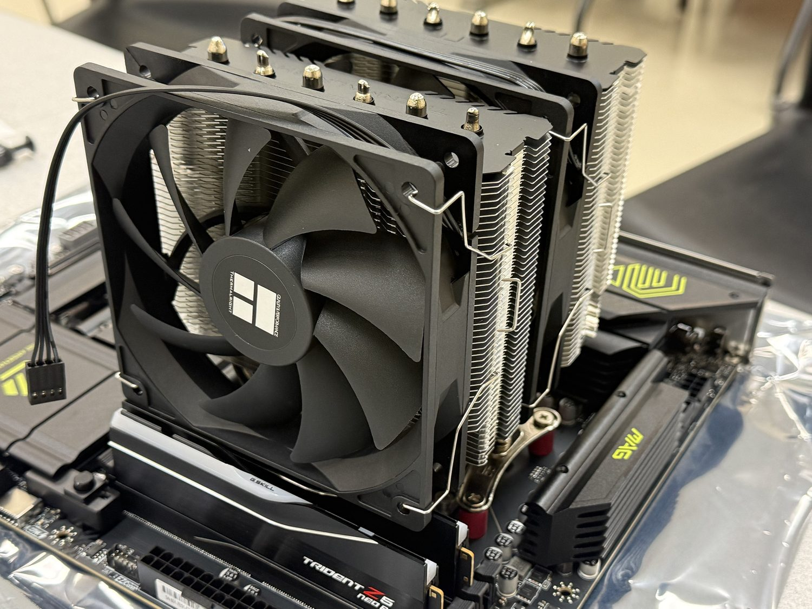

   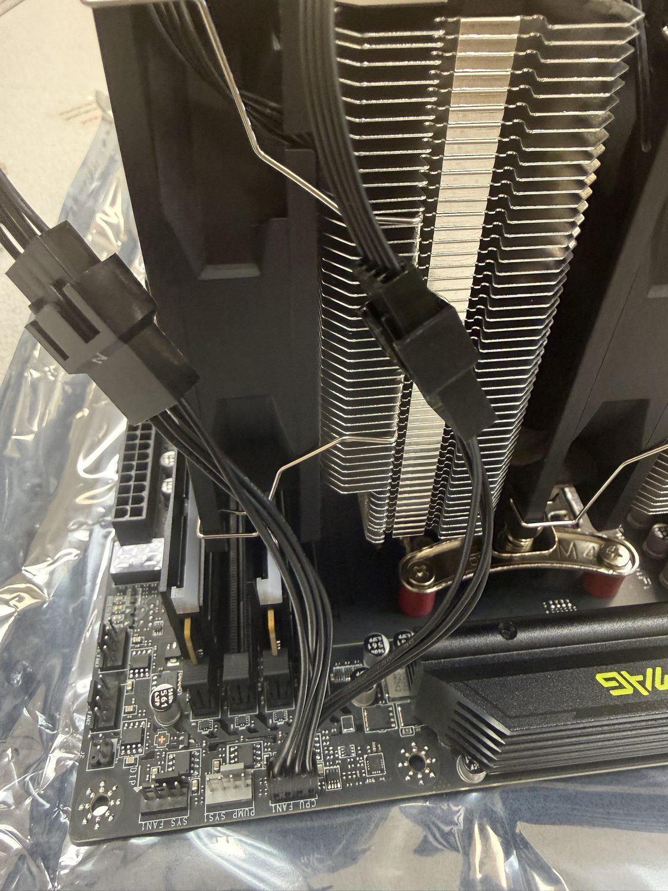

6. **Unbox the case and check the standoffs.**
   - Remove both side panels and set aside the screw packs that came with the case.
   - **There is no separate I/O shield to install.** On this board the shield is built into the rear I/O shroud and comes pre-attached from the factory. Older boards shipped a loose stamped-metal shield that had to be pressed into the case first; this one does not, so do not go looking for one in the box.
   - **Standoffs** are the small pillars that thread into the motherboard tray. The board never touches the tray directly: the standoffs hold it clear so the solder joints on the underside cannot short against the metal, and the screw-through-standoff path is also how the board grounds to the chassis. For that reason, never put insulating washers between the board and a standoff.
   - This case ships with standoffs already fitted for a standard ATX layout, which is what this board is. The extra bare threaded holes in the tray are alternate positions for other board sizes, and should be left empty.
   - Hold the board over the tray and confirm a standoff sits under **every** one of its nine mounting holes, and that **no** standoff sits anywhere the board has no hole. A stray standoff presses into the underside of the PCB and shorts it, and the only symptom is a machine that will not POST.
   - Find the motherboard screws in the case's screw pack. They have a wide flanged head and a coarse thread. Do not confuse them with the finer M3 screws used for 2.5-inch drives and fans, which will strip a standoff if you force them in. Count out nine before you start.

   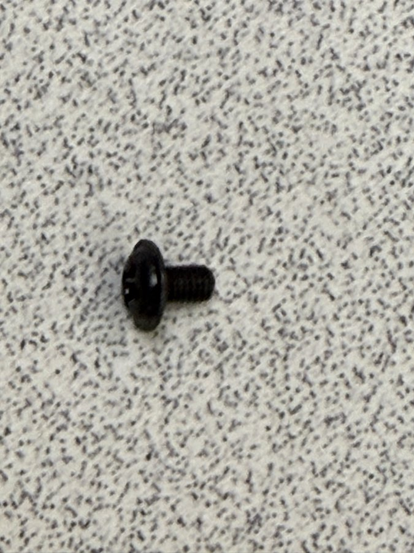 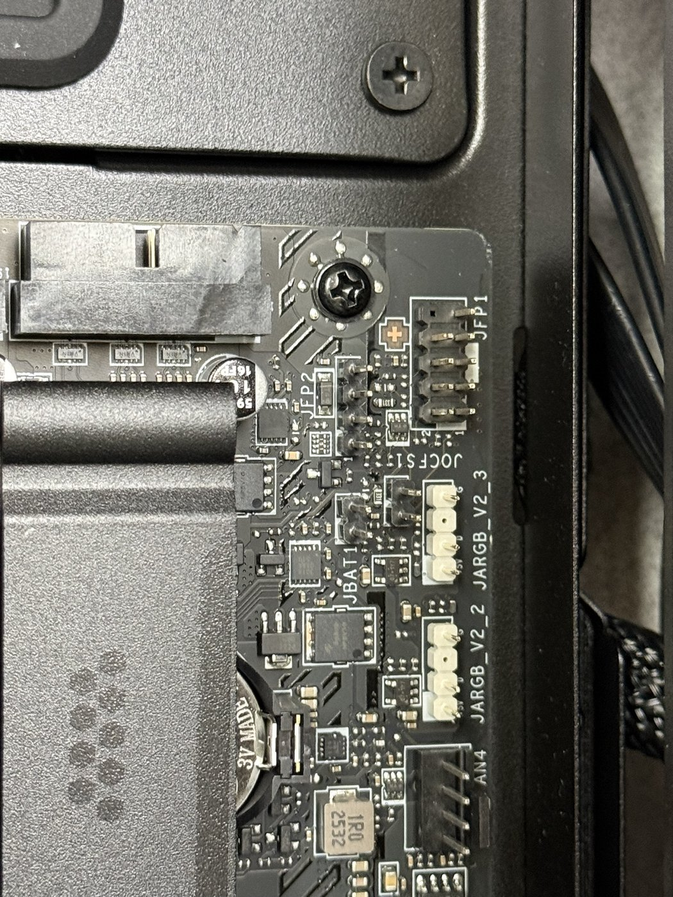

   On the right is what a correctly fitted screw looks like once the board is in: the flange bears on the bare metal ring around the mounting hole, not on any trace or component, and the standoff underneath carries the board clear of the tray. That bare ring is the ground contact, which is why nothing goes between it and the screw.

   This close view also shows the headers you will be reaching for in steps 10 and 11, all clustered along the same edge: `JFP1` for the power switch, `JFP2`, the `JBAT1` CMOS jumper, and two of the addressable RGB headers, `JARGB_V2_2` and `JARGB_V2_3`. Either RGB header will do for the case lighting.

   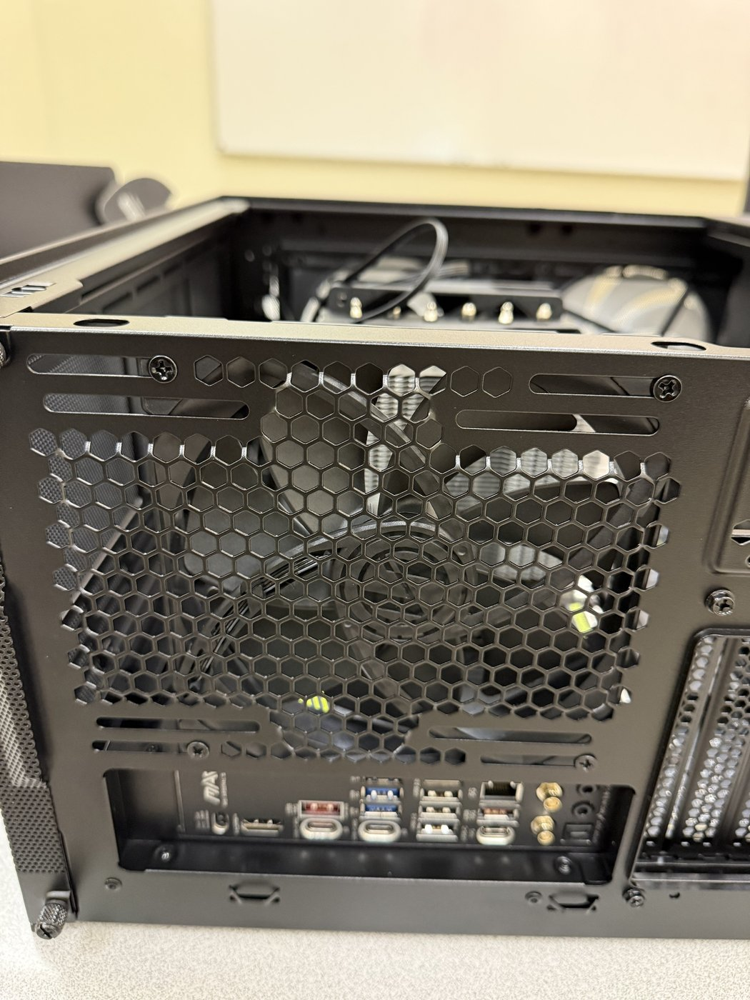 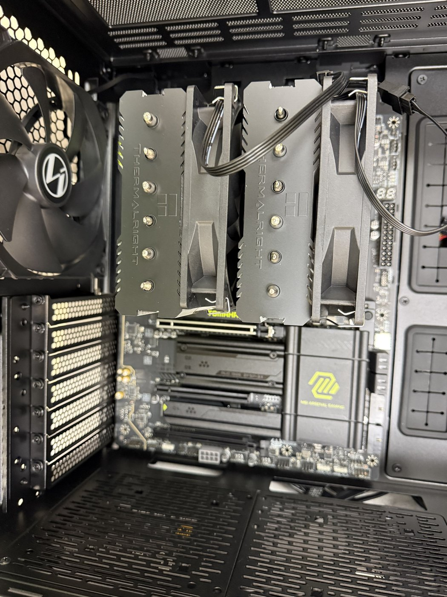

   The left photo is the evidence for the note above: the rear cutout is filled by the board's own integrated shroud, and there is no stamped shield behind it. The right photo is what the case looks like at the end of step 8, once the board is in. Nothing is wired yet.

7. **Connect the modular cables to the PSU, then mount it.**
   - Attach the cables you will need to the MSI MAG A1000GL PCIE5 **before** it goes in the case. There is far more room to work now than there will be once it is bolted into the basement.
   - You need: the 24-pin motherboard cable, **two** CPU/EPS cables, a SATA power cable for the case, and the native 12V-2x6 cable for the graphics card later.
   - Mount the PSU in its bay with the fan facing a vent, and secure it with the four screws.

8. **Mount the motherboard in the case.**
   - Lower the board in at an angle so the rear ports and their attached shield line up with the case cutout, then lay it flat onto the standoffs.
   - Fit all **nine** screws. Start them all by hand before tightening any, then tighten in a crisscross pattern so the board seats flat. Snug only: these thread into thin sheet metal and the PCB is brittle.

9. **Connect PSU power to the motherboard.**
   - Connect **both** CPU power cables to the two 8-pin EPS connectors along the top edge of the board. The 9900X pulls enough that both should be populated.
   - Connect the 24-pin cable to `ATX_PWR1` on the right edge. It only goes in one way, and it takes a firm push to latch.
   - Route the **native 12V-2x6 cable** now as well, from the PSU up through the cable cutout to where the graphics card will sit. Leave the card end unconnected until step 15. This is the PSU's own 16-pin cable rated for 600 W, not the 3 × 8-pin adapter that came in the graphics card box. Routing it at this stage is far easier than threading it past an installed card later.

   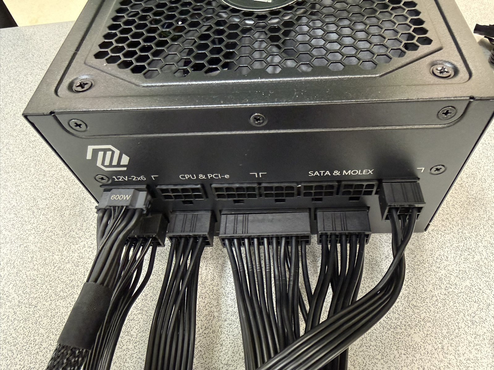

   The modular panel is labelled by group, and the cables are not interchangeable between groups even where the plugs physically fit. `12V-2x6` on the far left is the single 16-pin socket for the graphics card, and its cable carries a `600W` tag on the plug. The four `CPU & PCI-e` sockets feed the two EPS cables and any 8-pin PCIe cables. `SATA & MOLEX` on the right feeds the case hub in step 11. The 24-pin motherboard cable uses the wide socket in the middle.

   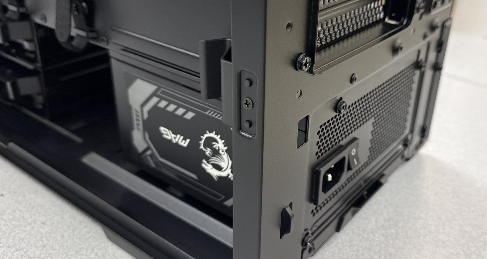

   The PSU sits in the basement with its fan facing the vent in the floor of the case, which is why the MSI logo on its side reads upside down from inside. The AC inlet and the rocker switch end up at the rear, reachable from outside once the build is done.

10. **Connect the front-panel cables from the case.**
    - Two front USB cables to their headers (`JUSB` / `JAUSB`).
    - Front audio to `JAUD1`.
    - The power switch lead to `JFP1`. Check the pin legend in the motherboard manual, since this header carries the power and reset switches and the LEDs in a specific arrangement.
    - These connectors are small, stiff, and located along the bottom and right edges. Doing them now, before the case fills up with cabling, is much easier.

11. **Connect case power, lighting, and fans.**
    - A SATA power lead from the PSU to the case, which powers the LANCOOL 216's fan and lighting hub.
    - The case's addressable RGB lead to `JARGB_V2`.
    - The case fan connector to a `SYS_FAN` header.

12. **Cable management.**
    - Route cables through the case's channels and behind the motherboard tray wherever possible.
    - Use zip ties or the case's built-in straps to pull loose cable away from any fan blades.

13. **Connect the display and power.**
    - Connect the monitor to the **motherboard's HDMI port**. There is no graphics card in the system yet, so the display runs off the CPU's integrated graphics.
    - Connect keyboard and mouse.
    - Connect the power cord to the PSU and switch the PSU's rocker on.

14. **First boot and BIOS check.**
    - Power on. Confirm the system POSTs and shows the motherboard splash screen.
    - Enter BIOS and confirm the CPU, both memory modules (correct total capacity), and the SSD are all detected.
    - **Enable the memory's EXPO profile.** Until you do, DDR5 runs at its JEDEC default of 4800 MT/s rather than the 6000 the kit is rated for, no matter which slots you used.
    - Set the system date and time. A new board comes up at its firmware default, which is years out.
    - If the board does not POST, the `EZ Debug LED` block (BOOT / VGA / DRAM / CPU) shows which subsystem it stalled on, and the two-digit POST code display narrows it further.

    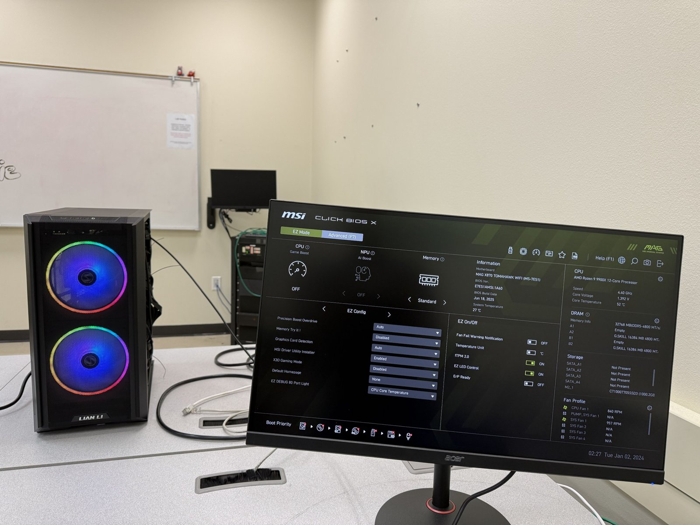

    MSI's `Click BIOS X` opens in `EZ Mode`, which is the fastest way to check your work. Read down the right-hand column:

    - **CPU**: `AMD Ryzen 9 9900X 12-Core Processor`. The board recognises the chip.
    - **DRAM**: `A1 Empty`, `A2 G.SKILL 16384 MB`, `B1 Empty`, `B2 G.SKILL 16384 MB`, totalling `32768 MB`. This is the check on step 2. Two populated slots, one per channel, both in the far position, with the near slots empty. If your `A1` and `A2` were filled instead of `A2` and `B2`, the total would look identical and only this screen would tell you.
    - **Storage**: `M2_1  CT1000T705SSD3`. The T705 is detected in the Gen 5 slot from step 3. Every `SATA` line reads `Not Present`, which is correct since this build has no SATA drives.
    - **Fan Profile**: `CPU Fan 1` and `SYS Fan 1` both turning. A fan reading `N/A` is a header with nothing plugged into it.

    Note that `Memory Info` reads `DDR5-4800 MT/s` and the `Memory` selector at the top still says `Standard`. That is the JEDEC default, not the DDR5-6000 the kit is rated for. Switch that selector to the EXPO profile and reboot, then come back and confirm the speed has changed. Until you do, you have paid for memory you are not using.

    - Power down fully and switch the PSU off before opening the case again.

15. **Install the graphics card.**
    - Remove the rear expansion slot covers the card needs.
    - Open the latch on the top PCIe x16 slot, line the card's edge connector up with the slot, and press down evenly until the latch clicks and the bracket sits flush. Screw the bracket to the case.

    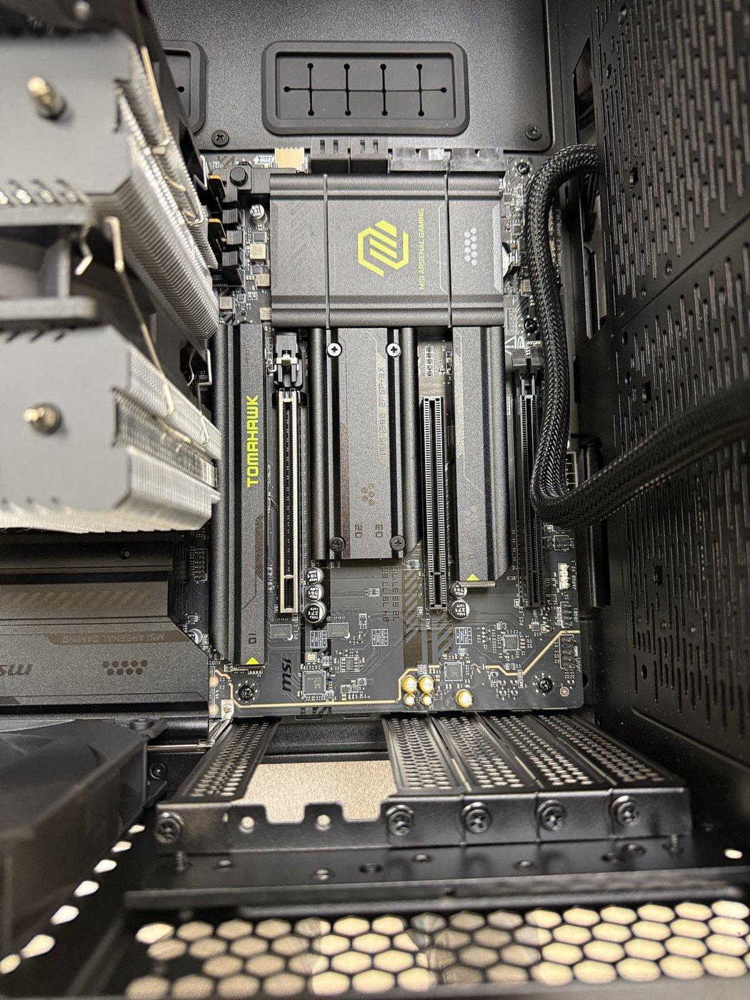 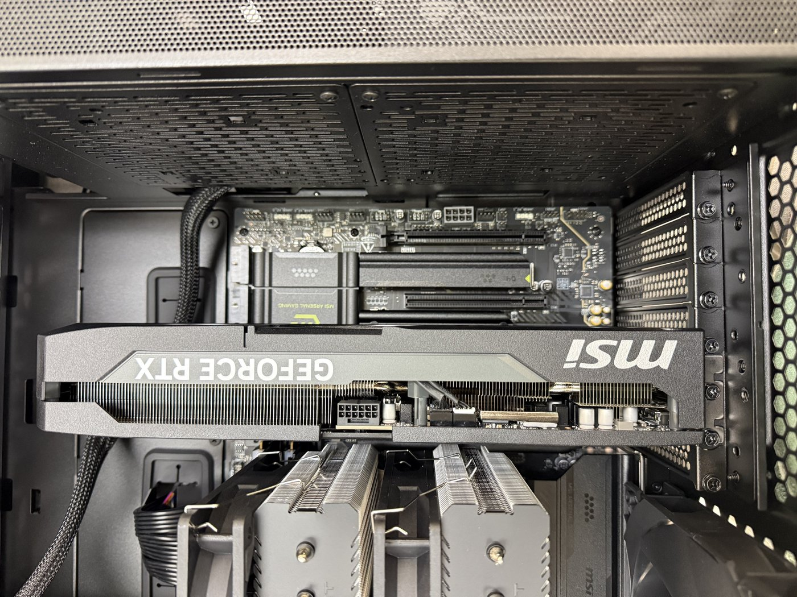

    Before and after. Use the **top** x16 slot: it is the only one wired to the CPU at full width, and the lower slots run at reduced lanes off the chipset. The card is three slots thick, so it covers the second x16 slot entirely, which is expected and not a mistake.
    - **Power it with the PSU's native 12V-2x6 cable**, the 16-pin one rated for 600 W. Do **not** use the 8-pin adapter that came in the graphics card box: that adapter exists for older ATX 2.x supplies with no 16-pin cable, and it needs three 8-pin feeds because its sense pins report the available power. Your PSU has the proper cable, and using it means fewer connections and less contact resistance.
    - **Seat the connector completely.** Push until it clicks. A partially seated 12V-2x6 plug concentrates the whole current through one or two contacts, which is the cause behind essentially every melted-connector story. MSI's cable is dual-colour for exactly this reason: **if you can still see the yellow band, it is not fully home.**
    - Give the cable about 35 mm of straight run before any bend, so the strain does not lift contacts inside the plug.

    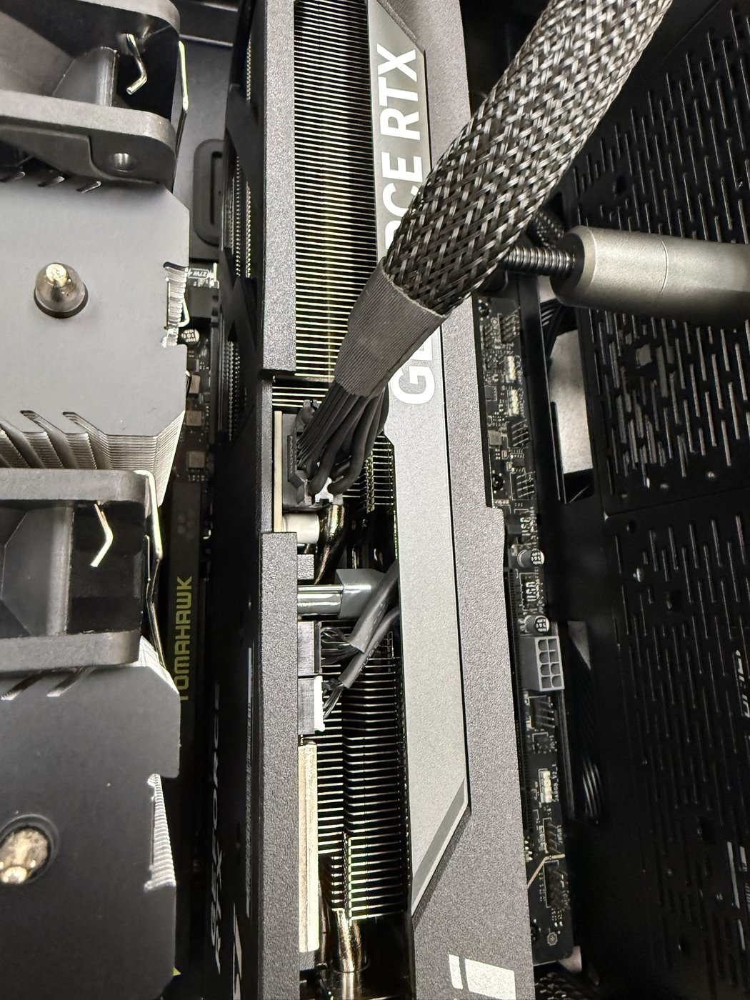

    The cable enters the connector on the card's top edge and runs straight up before it turns toward the cable cutout. Note how much clearance the side panel leaves above the card: that is the space the cable has to make its bend in, and it is why the run is straight for the first inch or so rather than turning at the plug.

    - Fit the card's support bracket now to stop it sagging. The 5080 is a heavy three-slot card, and over months the weight works on the PCIe slot and the card's own PCB.

    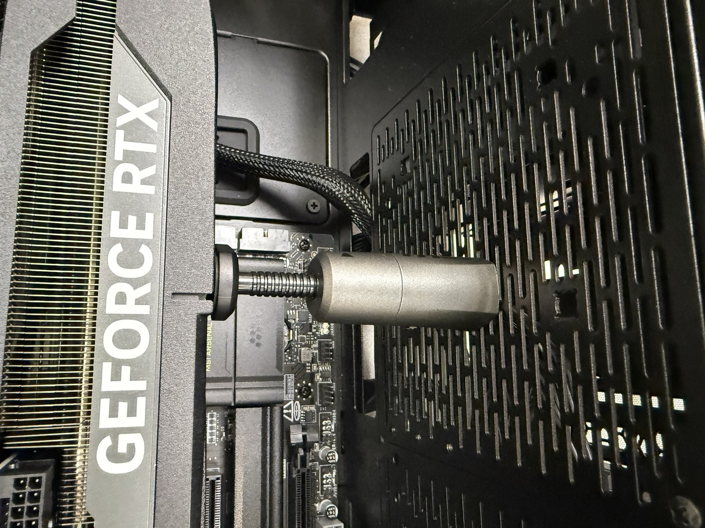

    Extend the post until it just touches the underside of the card, then stop. It is there to carry the weight, not to push the card back up: forcing it will lever the edge connector in the slot.
    - Move the monitor cable from the motherboard to the **graphics card's** output, then boot again and confirm the card is detected.

16. **Close up the case.**
    - Once the system boots successfully with the card in, do a final check for loose screws or tools inside, then refit both side panels.
